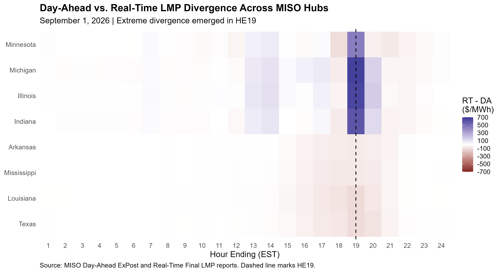
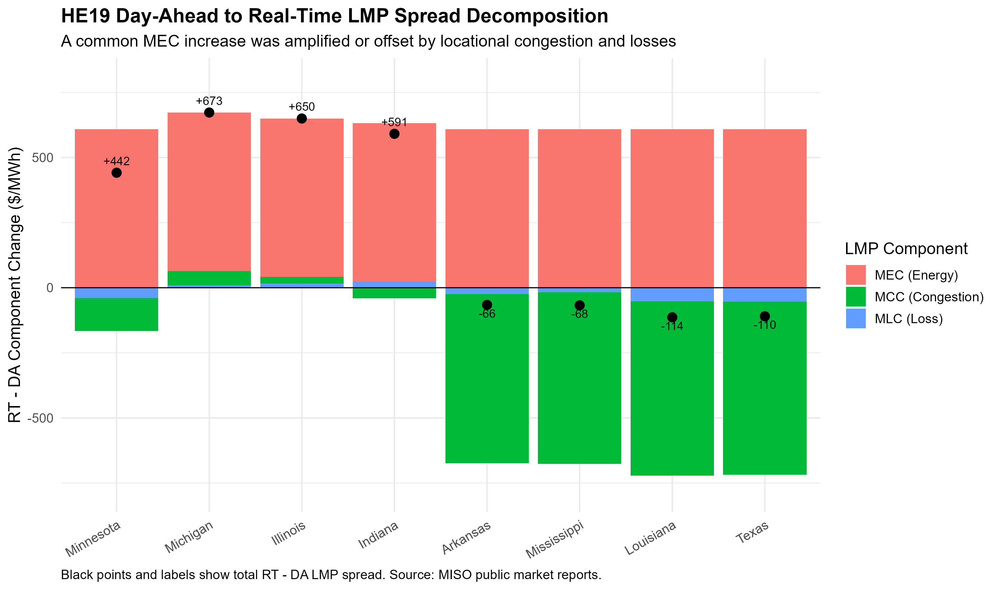

# MISO Market Evaluation and Automated Monitoring

## Day-Ahead vs. Real-Time LMP Divergence, Historical Alerts, and Event Decomposition

This project evaluates Day-Ahead (DA) and Real-Time (RT) electricity-price divergence in the Midcontinent Independent System Operator (MISO) market using public MISO market reports and reproducible R workflows.

The project has two connected parts:

1. **Automated market monitoring** — builds a 62-day historical baseline for eight named MISO hubs, applies hub-specific empirical alert thresholds, and generates a parameterized HTML monitoring report.
2. **September 1, 2026 event evaluation** — examines the large HE19 DA-RT divergence, decomposes the LMP change into energy, congestion, and loss components, and evaluates system-load context.

The monitored day, September 1, 2026, is excluded from the historical baseline and evaluated out of sample.

---

## What This Project Demonstrates

- Automated download and caching of MISO DA ExPost and RT Final LMP reports
- Reproducible DA-RT data preparation and QA
- Historical-baseline alert design
- Parameterized daily HTML reporting
- LMP component decomposition
- Event-focused market evaluation
- Robust-statistics diagnostics for heavy-tailed price spreads
- Clear separation between statistical detection and causal interpretation

---

## Automated Monitoring Result

The historical baseline covers:

- **July 1-August 31, 2026**
- **62 market days**
- **8 named hubs**
- **24 hourly observations per day**
- **11,904 LMP hub-hour observations**

For each hub, the primary monitoring rule flags a hub-hour when:

$$
|RT - DA| > \text{historical hub-specific 99th percentile}
$$

Each hub therefore uses 1,488 historical LMP spread observations:

$$
62 \times 24 = 1{,}488
$$

The September 1, 2026 monitoring run generated **4 primary alerts**, all at HE19:

| Hub | DA LMP | RT LMP | RT - DA | Historical P99 |
|---|---:|---:|---:|---:|
| Michigan | 569 | 1,242 | +673 | 294 |
| Illinois | 514 | 1,164 | +650 | 271 |
| Indiana | 563 | 1,154 | +591 | 286 |
| Minnesota | 592 | 1,033 | +442 | 335 |

Values are approximately USD/MWh.

A secondary robust diagnostic based on historical median and median absolute deviation (MAD) is also calculated for each hub-hour. It is retained as supporting context but is **not** used as the primary alert trigger.

**Example outputs**

- [Automated alert table](data/processed/automated_lmp_alerts_20260901.csv)
- [Example HTML monitoring report](report/daily_market_monitor_20260901.html)

---

## One-Command Daily Monitoring Workflow

After the historical baseline has been built, the complete monitoring process can be run with:

```r
source("market-evaluation/R/05_run_daily_monitor.R")
run_daily_monitor("2026-09-01")
```

The function:

1. Downloads or reuses cached DA ExPost and RT Final LMP reports.
2. Validates the source files.
3. Extracts eight named hubs and LMP/MCC/MLC components.
4. Joins DA and RT observations.
5. Performs daily row-count and hub/component QA.
6. Applies the historical P99 alert rule.
7. Calculates robust MAD-based diagnostics.
8. Saves processed daily spread and alert tables.
9. Renders the parameterized HTML monitoring report.

The current implementation uses the fixed July 1-August 31, 2026 historical baseline. A rolling baseline would be a natural production extension.

---

# September 1, 2026 Event Evaluation

## 1. HE19 showed an extreme DA-RT price divergence

Across eight named MISO pricing hubs, DA and RT LMPs were generally much closer during most hours of September 1. A pronounced divergence appeared in HE19.

Approximate HE19 RT-minus-DA spreads were:

- Michigan: **+673 USD/MWh**
- Illinois: **+650 USD/MWh**
- Indiana: **+591 USD/MWh**
- Minnesota: **+442 USD/MWh**
- Arkansas: **-66 USD/MWh**
- Mississippi: **-68 USD/MWh**
- Louisiana: **-114 USD/MWh**
- Texas: **-110 USD/MWh**

Positive values indicate RT LMP above DA LMP.



The heatmap shows both the timing and cross-hub pattern of the event. HE19 stands out sharply relative to the rest of the day.

---

## 2. The common energy component increased by about 608 USD/MWh

For each hub, LMP was decomposed using:

$$
LMP = MEC + MCC + MLC
$$

where:

- **MEC** = Marginal Energy Component
- **MCC** = Marginal Congestion Component
- **MLC** = Marginal Loss Component

Because the public LMP files directly provide LMP, MCC, and MLC, the marginal energy component was recovered as:

$$
MEC = LMP - MCC - MLC
$$

For HE19, the inferred DA-to-RT change in MEC was approximately:

$$
\Delta MEC \approx +608 \text{ USD/MWh}
$$

at all eight named hubs analyzed.

This indicates that a large common energy-price increase was present across the analyzed hubs.

---

## 3. Congestion produced sharply different hub-level price outcomes

The common MEC increase did not translate into similar LMP changes at every location.

At Michigan, Illinois, and Indiana, congestion and loss adjustments were relatively small compared with the common MEC increase. As a result, most of the energy-price increase remained visible in the final RT-DA LMP spread.

At the selected southern hubs, large negative congestion-component changes offset much of the common energy increase.

For example:

- **Michigan**
  - MEC change: approximately +608 USD/MWh
  - MCC change: approximately +55 USD/MWh
  - MLC change: approximately +10 USD/MWh
  - Total LMP spread: approximately **+673 USD/MWh**

- **Louisiana**
  - MEC change: approximately +608 USD/MWh
  - MCC change: approximately -670 USD/MWh
  - MLC change: approximately -52 USD/MWh
  - Total LMP spread: approximately **-114 USD/MWh**



The black points in the figure show the total RT-DA LMP spread. The bars show the MEC, MCC, and MLC contributions.

The decomposition satisfies, up to numerical rounding:

$$
\Delta LMP =
\Delta MEC +
\Delta MCC +
\Delta MLC
$$

for every hub included in the analysis.

---

## 4. HE19 was not the system-load peak

MISO-wide historical forecast and actual load data were used to provide additional context.

On September 1, 2026:

- HE19 reported ActualLoad: approximately **116,540 MWh**
- Daily maximum ActualLoad: approximately **120,422 MWh**
- Daily maximum occurred at **HE17**
- HE19 load forecast error: approximately **-776 MWh**

Therefore, the extreme HE19 price divergence did **not** coincide with the day's maximum reported system load.

The HE19 system-wide forecast error was also smaller than several forecast errors observed earlier in the day.

These checks show that peak system load or an unusually large system-wide load forecast error does not provide a sufficient standalone explanation for the HE19 pricing event.

---

# Analytical Workflow

## Historical monitoring workflow

```text
MISO DA / RT reports
        |
        v
Automated download + file validation
        |
        v
8 named hubs x 24 hours
        |
        v
62-day historical baseline
        |
        v
Hub-specific empirical P99 thresholds
        |
        v
Daily out-of-sample monitoring
        |
        v
Automated alert table + robust diagnostics
        |
        v
Parameterized HTML report
```

## Event-evaluation workflow

1. **Prepare market data**
   - Read MISO Day-Ahead ExPost LMP data
   - Read MISO Real-Time Final LMP data
   - Convert hourly columns from wide to long format
   - Match DA and RT observations by market day, hour, node, node type, and LMP component

2. **Calculate DA-RT divergence**

$$
Spread = RT - DA
$$

3. **Identify unusual hub-hour behavior**
   - Historical monitoring uses hub-specific empirical P99 thresholds
   - September 1 is evaluated outside the July-August calibration window

4. **Decompose the HE19 LMP spread**
   - Separate the change into MEC, MCC, and MLC contributions

5. **Evaluate load context**
   - Compare HE19 load with the daily peak
   - Examine forecast-versus-actual load error

6. **Validate results**
   - Check source-file structure
   - Check expected hub/hour/component row counts
   - Check algebraic LMP decomposition
   - Check load completeness and duplicate date-hour-zone observations

---

# Project Structure

```text
market-evaluation/
├── R/
│   ├── 01_prepare_data.R
│   ├── 02_he19_event_analysis.R
│   ├── 03_build_history.R
│   ├── 04_alert_monitor.R
│   └── 05_run_daily_monitor.R
├── data/
│   ├── raw/                  # ignored by Git
│   └── processed/
│       ├── named_hub_da_rt_history_20260701_20260831.csv
│       ├── named_hub_da_rt_spreads_20260901.csv
│       └── automated_lmp_alerts_20260901.csv
├── figures/
│   ├── fig1_named_hub_da_rt_spread_heatmap.png
│   └── fig2_he19_lmp_spread_decomposition.png
├── report/
│   ├── daily_market_monitor.Rmd
│   └── daily_market_monitor_20260901.html
└── README.md
```

---

# Data

## MISO LMP reports

The automated historical and daily monitoring workflows use public MISO market-report files following the naming patterns:

```text
YYYYMMDD_da_expost_lmp.csv
YYYYMMDD_rt_lmp_final.csv
```

The scripts construct URLs from:

```text
https://docs.misoenergy.org/marketreports/
```

Raw downloaded LMP files are cached locally and excluded from GitHub through `.gitignore`.

## Historical load report

The event-context analysis also uses:

```text
20260925_dfal_HIST.xls
```

The September 25 historical load report contains observations for earlier market dates, including September 1. The analysis matches observations using the `MarketDay` field rather than the report publication date.

The raw load report is also excluded from the repository.

---

# Data Quality Checks

## Historical DA-RT baseline

The July-August baseline was validated against the expected grid:

```text
62 days x 8 hubs x 24 hours x 3 components = 35,712 rows
```

Observed:

```text
35,712 rows
0 missing expected observations
```

The LMP-only baseline contains:

```text
62 days x 8 hubs x 24 hours = 11,904 observations
```

## Daily monitor

For each monitored day, the automated workflow checks for:

```text
8 hubs x 24 hours x 3 components = 576 joined rows
```

and:

```text
8 hubs x 24 hours = 192 LMP hub-hour rows
```

The September 1 automated run passed both checks.

## Historical load data

The historical load file was checked for completeness and duplicate observations.

For each included market date, the data contain 24 hourly observations for each load-resource-zone category, with no duplicate combinations of:

```text
MarketDay x HourEnding x LoadResourceZone
```

Three calendar dates are absent from that historical load source file:

```text
2026-04-20
2026-08-17
2026-08-18
```

These missing load dates do not affect the September 1 event analysis.

---

# Reproducing the Analysis

Required R packages:

```r
install.packages(c(
  "tidyverse",
  "readxl",
  "rmarkdown"
))
```

## A. Build the 62-day historical monitoring baseline

From the repository root:

```r
source("market-evaluation/R/03_build_history.R")
```

This script automatically downloads and caches July 1-August 31 DA and RT reports, builds the eight-hub historical spread dataset, and performs coverage QA.

## B. Run the automated daily monitor

```r
source("market-evaluation/R/05_run_daily_monitor.R")
run_daily_monitor("2026-09-01")
```

This downloads the selected day's DA and RT reports, evaluates the day against the historical baseline, exports the alert table, and renders the HTML report.

## C. Reproduce the detailed September 1 event decomposition

For the original component-decomposition and load-context analysis, place:

```text
20260901_da_expost_lmp.csv
20260901_rt_lmp_final.csv
20260925_dfal_HIST.xls
```

in:

```text
market-evaluation/data/raw/
```

Then run:

```r
source("market-evaluation/R/01_prepare_data.R")
source("market-evaluation/R/02_he19_event_analysis.R")
```

`04_alert_monitor.R` is retained as a standalone alert-analysis script used to inspect and validate the alert logic during development. The one-command workflow in `05_run_daily_monitor.R` incorporates the operational alert calculation directly.

---

# Interpretation and Limitations

The automated alert is a **screening rule**, not a causal model. It identifies hub-hour DA-RT spreads that are unusually large relative to each hub's recent historical distribution.

The September 1 analysis shows:

- four automated HE19 P99 alerts at Michigan, Illinois, Indiana, and Minnesota;
- a large common MEC increase across the eight analyzed hubs;
- materially different congestion effects across locations;
- no coincidence between HE19 and the day's maximum reported system load; and
- no unusually large system-wide load forecast error sufficient to explain the event by itself.

The analysis does **not** establish the operational cause of the HE19 divergence.

Additional information on generation availability, outages, reserves, interchange, transmission constraints, market commitments, and other system conditions would be required for causal attribution.

The current monitoring baseline is fixed to July-August 2026. A production implementation would likely use a rolling window, production scheduling, persistent logging, and additional operational data sources.
