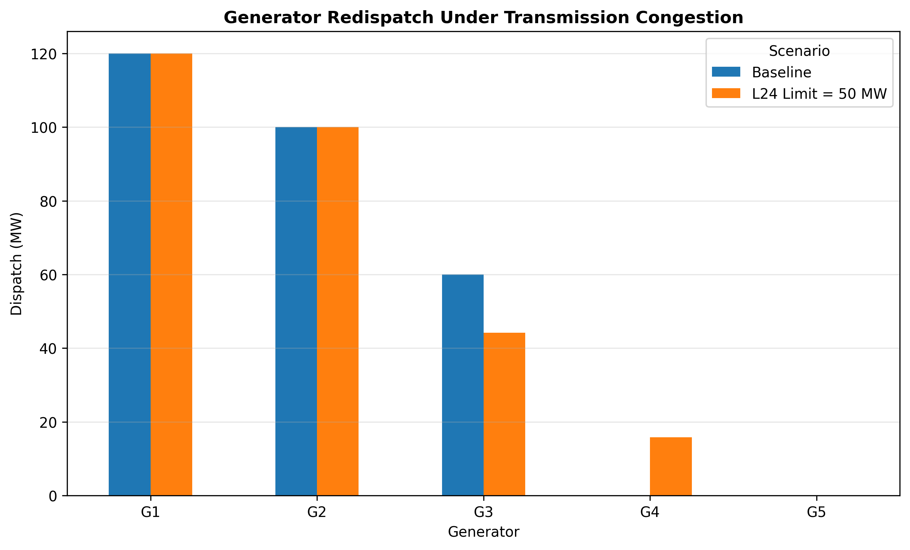
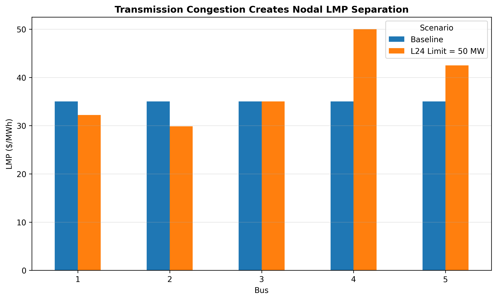
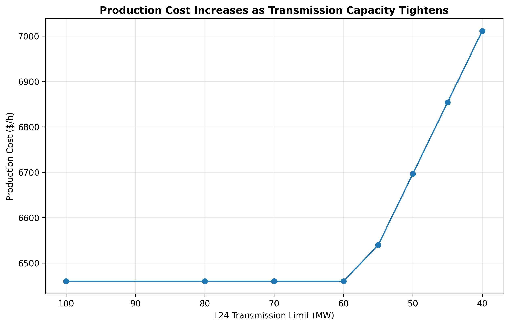
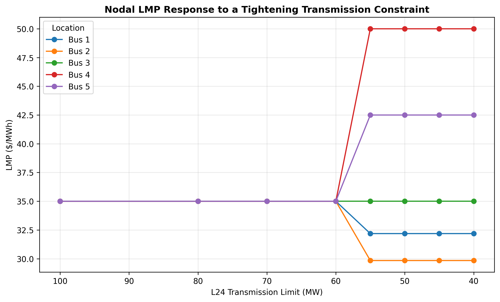

# Energy Market R&D Case Study
## DC Optimal Power Flow, Transmission Congestion, and Locational Marginal Pricing

This project develops a synthetic electricity-market clearing model using DC optimal power flow (DC-OPF).

The objective is to demonstrate how transmission constraints affect:

- least-cost generation dispatch;
- network power flows;
- total production cost;
- locational marginal prices (LMPs); and
- the marginal economic value of transmission capacity.

The model is implemented in Python using Pyomo and the HiGHS optimization solver.

> This is a synthetic five-bus system designed for optimization and market-analysis demonstrations. It is not a representation of the actual MISO transmission network.

---

## Key Findings

### 1. Without congestion, nodal LMPs are uniform

The baseline system contains:

- 5 buses;
- 5 generators;
- 6 transmission lines;
- 280 MW of fixed load; and
- linear generator marginal costs.

The least-cost baseline dispatch is:

| Generator | Marginal Cost ($/MWh) | Dispatch (MW) |
|---|---:|---:|
| G1 | 18 | 120 |
| G2 | 22 | 100 |
| G3 | 35 | 60 |
| G4 | 50 | 0 |
| G5 | 65 | 0 |

Total production cost is:

**$6,460/hour**

No transmission constraint is binding.

Because G3 is the marginal generator and the network is uncongested, all five buses have the same LMP:

**$35/MWh**

---

## 2. A binding transmission constraint causes redispatch

A congestion scenario reduces the L24 transmission limit from 100 MW to 50 MW.

The L24 constraint becomes binding:

- L24 flow: **50 MW**
- L24 utilization: **100%**

The system can no longer maintain the unconstrained least-cost dispatch.

Generation changes from:

- G3: **60.00 → 44.22 MW**
- G4: **0.00 → 15.78 MW**

The more expensive G4 must increase production to maintain feasibility.

Total production cost increases from:

**$6,460.00/hour**

to:

**$6,696.72/hour**

for a congestion-related increase of approximately:

**$236.72/hour**



---

## 3. Congestion creates locational price separation

In the uncongested baseline, all buses have an LMP of $35/MWh.

After the L24 constraint becomes binding, nodal LMPs become:

| Bus | Baseline LMP | Congested LMP |
|---|---:|---:|
| 1 | 35.00 | 32.19 |
| 2 | 35.00 | 29.84 |
| 3 | 35.00 | 35.00 |
| 4 | 35.00 | 50.00 |
| 5 | 35.00 | 42.50 |

The resulting LMP range is approximately:

**$20.16/MWh**



The result illustrates an important property of meshed transmission networks:

> Congestion does not simply make every location more expensive.

The marginal impact of an additional MW of load depends on how injections and withdrawals affect the binding network constraint.

As a result, some nodal prices increase while others decrease.

---

## 4. Congestion begins only when transmission capacity becomes binding

The L24 transmission limit was progressively reduced:

```text
100, 80, 70, 60, 55, 50, 45, 40 MW
```

Under the unconstrained dispatch, the natural L24 flow is approximately:

**57.54 MW**

Therefore, transmission limits above this value do not affect the optimal solution.

| L24 Limit (MW) | L24 Flow (MW) | Production Cost ($/h) | LMP Dispersion ($/MWh) |
|---:|---:|---:|---:|
| 100 | 57.54 | 6,460.00 | 0.00 |
| 80 | 57.54 | 6,460.00 | 0.00 |
| 70 | 57.54 | 6,460.00 | 0.00 |
| 60 | 57.54 | 6,460.00 | 0.00 |
| 55 | 55.00 | 6,539.69 | 20.16 |
| 50 | 50.00 | 6,696.72 | 20.16 |
| 45 | 45.00 | 6,853.75 | 20.16 |
| 40 | 40.00 | 7,010.78 | 20.16 |

The results show a clear threshold:

- above approximately 57.54 MW, the constraint is nonbinding;
- below that threshold, congestion changes dispatch, cost, and nodal prices.



---

## 5. Nodal prices respond discontinuously when the active constraint set changes

Before L24 becomes binding, all nodal LMPs remain:

**$35/MWh**

Once the transmission constraint becomes active, nodal prices separate.

Within the range examined, the active set and marginal generators remain unchanged after congestion begins. Therefore, the nodal LMP pattern remains constant as the L24 limit is tightened further.



This is consistent with the piecewise-linear structure of the linear DC-OPF model.

---

## 6. The transmission shadow price measures the marginal value of capacity

The dual value of the binding L24 transmission constraint was extracted from the optimization model.

For nonbinding cases:

```text
L24 limit >= 60 MW
Capacity value = $0
```

For the binding cases examined:

```text
L24 limit = 55, 50, 45, 40 MW
Capacity value ≈ $31.41 per additional MW per operating hour
```

This dual result can be verified directly using the change in optimal production cost.

For example:

$$
\frac{6696.72 - 6539.69}{55 - 50}
\approx 31.41
$$

Therefore, within this operating regime, increasing L24 capacity by 1 MW reduces optimal production cost by approximately:

**$31.41 per operating hour**

The agreement between the optimization dual and the finite-difference calculation provides a direct primal-dual validation of the sensitivity result.

---

## Optimization Model

The objective is to minimize total variable generation cost:

$$
\min \sum_g c_g P_g
$$

subject to:

### Generator limits

$$
0 \leq P_g \leq P_g^{\max}
$$

### DC transmission flow

$$
F_{ij}
=
\frac{\text{BaseMVA}}{x_{ij}}
(\theta_i-\theta_j)
$$

### Transmission capacity

$$
-\bar{F}_{ij}
\leq
F_{ij}
\leq
\bar{F}_{ij}
$$

### Nodal power balance

At every bus:

$$
\text{Generation}
-
\text{Load}
-
\text{Net Export}
=
0
$$

One bus angle is fixed as the reference angle.

The economic LMP at each bus is recovered from the dual value of the nodal power-balance constraint.

---

## Analytical Workflow

The project follows this sequence:

1. **Build a baseline DC-OPF**
   - define generators, buses, loads, and transmission lines;
   - minimize total production cost;
   - calculate power flows and LMPs.

2. **Validate the uncongested solution**
   - check total generation equals total load;
   - verify no line is binding;
   - confirm uniform nodal LMPs.

3. **Introduce transmission congestion**
   - reduce the L24 transmission limit;
   - identify the binding constraint;
   - quantify generator redispatch and production-cost increase.

4. **Evaluate locational prices**
   - extract nodal-balance duals;
   - compare LMPs before and after congestion.

5. **Perform transmission sensitivity analysis**
   - progressively tighten the L24 limit;
   - track cost, dispatch, line utilization, and LMP dispersion.

6. **Interpret dual values**
   - extract the transmission-constraint shadow price;
   - validate it using finite differences in optimal production cost.

---

## Project Structure

```text
market-rnd/
│
├── README.md
│
├── python/
│   ├── 01_baseline_dcopf.py
│   ├── 02_congested_dcopf.py
│   ├── 03_visualize_scenarios.py
│   └── 04_transmission_sensitivity.py
│
├── data/
│   └── input/
│
├── results/
│   ├── baseline_generator_dispatch.csv
│   ├── baseline_line_flows.csv
│   ├── baseline_bus_lmps.csv
│   ├── scenario_generator_dispatch.csv
│   ├── scenario_line_flows.csv
│   ├── scenario_bus_lmps.csv
│   └── transmission_limit_sensitivity.csv
│
└── figures/
    ├── fig1_generator_redispatch.png
    ├── fig2_nodal_lmp_comparison.png
    ├── fig3_transmission_limit_cost_sensitivity.png
    └── fig4_transmission_limit_lmp_sensitivity.png
```

---

## Reproducing the Analysis

Python 3.12 was used for development.

Install the required packages:

```bash
python -m pip install pyomo highspy pandas matplotlib
```

Run the scripts from the repository root in order:

```bash
python market-rnd/python/01_baseline_dcopf.py
python market-rnd/python/02_congested_dcopf.py
python market-rnd/python/03_visualize_scenarios.py
python market-rnd/python/04_transmission_sensitivity.py
```

---

## Interpretation and Limitations

This project is intended to demonstrate electricity-market optimization concepts rather than reproduce an actual MISO market-clearing engine.

The model intentionally simplifies several features of real wholesale electricity markets.

It does not include:

- unit commitment and binary startup decisions;
- startup and no-load costs;
- ramp-rate constraints;
- operating reserves;
- generator minimum-output constraints;
- transmission losses;
- security contingencies;
- nonlinear AC power flow;
- multi-period intertemporal constraints; or
- the full topology of an actual regional transmission system.

Real market-clearing systems use substantially more detailed security-constrained commitment and dispatch formulations.

The simplified DC-OPF model is used here because its linear structure makes the relationship among transmission constraints, redispatch, LMPs, and dual values transparent and directly interpretable.

---

## Connection to Market Evaluation

This optimization experiment complements the empirical MISO market-evaluation project in this repository.

The Market Evaluation case study observes actual MISO Day-Ahead and Real-Time price separation and decomposes LMP changes into energy, congestion, and loss components.

This R&D case study demonstrates the underlying optimization mechanism through which a binding transmission constraint can:

- force generator redispatch;
- increase production cost;
- create locational price separation; and
- assign an economic value to incremental transmission capacity.

Together, the two projects connect observed wholesale-market outcomes with optimization-based market-clearing mechanisms.
